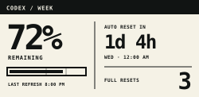
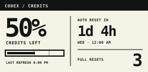

# Codex usage desk display

A tiny, glanceable Codex allowance display built with an Elecrow 2.13-inch
ESP32 e-paper CrowPanel and a local Mac service. It shows:

- percentage remaining in the seven-day Codex window
- paid-credit percentage after the included weekly allowance reaches zero
- countdown and local time for the next automatic reset
- available full-reset credits when Codex reports them
- the local time of the last successful refresh



When paid credits take over, the same meter changes its header and label so the
percentage cannot be mistaken for the weekly allowance:



The repository also includes the parametric OpenSCAD source and printable
meshes for the small magnetic picture-frame enclosure.

## Build story and enclosure downloads

- [Read the build story](https://lindsaybrunner.com/blog/2026-09-25/build-e-ink-codex-usage-display-with-ai/)
- [Download the enclosure on Printables](https://www.printables.com/model/1843634-magnetic-desk-frame-for-elecrow-213-inch-e-paper-c)
- [Get the enclosure and Bambu Studio project on MakerWorld](https://makerworld.com/en/models/3312280-magnetic-frame-for-elecrow-2-13in-e-paper#profileId-3760454)

## Hardware

- [Elecrow 2.13-inch ESP32 e-paper CrowPanel](https://www.amazon.com/dp/B0FX4PZZMQ)
- a data-capable USB-C cable; the enclosure was fitted around this
  [right-angle cable](https://www.amazon.com/dp/B0DQ89GVNM)
- eight 3 x 1 mm disc magnets; the tested size came from this
  [mixed magnet set](https://www.amazon.com/dp/B0FMS4GTB6)
- a Mac with a free USB data port, directly or through a data-capable dock

## Status and compatibility

The display firmware and host service have been physically tested on:

- Elecrow CrowPanel ESP32 2.13-inch black-and-white e-paper HMI, 250 × 122
- ESP32 Arduino core 2.0.10
- macOS with Codex signed into the local Codex app or CLI
- the board's CH340K USB bridge, accessed through libusb
- Node.js 22 or newer and Python 3

The V5 enclosure keeps the V4 frame and 60-degree stand, then replaces the
rear cover with a one-layer preload correction, as described in the build
story. See [the enclosure notes](enclosure/README.md) before printing it.

The host reads `account/rateLimits/read` from the experimental local Codex
app-server. This is not a documented, stable OpenAI public API. A future Codex
release can change the method or response shape; the strict parser will fail
closed rather than display invented values.

## How it works

```text
signed-in Codex -> local app-server -> privacy filter -> USB -> ESP32 -> e-paper
```

Authentication stays on the Mac. The host explicitly selects the reported
`10080`-minute weekly window, whether Codex returns it as `primary` or
`secondary`. The message sent to the ESP32 contains only display values and
timestamps; it never contains an account ID, token, API key, or reset-credit
ID. The weekly meter remains active until the source reports 100% used. If a
paid-credit full balance is configured, the meter then switches to the current
paid balance as a percentage of that local full mark. The raw balance and its
dollar value never cross the USB boundary. Paid mode remains live while a
positive balance is available; `LIMITED` appears after both included and paid
usage are exhausted.

The service polls every five minutes. Routine updates use a low-flicker
partial waveform, with a full cleanup refresh after 24 partials or after the
board restarts.

## Get the project

```sh
git clone https://github.com/LindsayB610/codex-usage-desk-display.git
cd codex-usage-desk-display
```

## Prepare and flash the firmware

Install Arduino CLI, Python 3, and libusb. On a Homebrew Mac:

```sh
brew install arduino-cli libusb
arduino-cli config init
arduino-cli core update-index
arduino-cli core install esp32:esp32@2.0.10
python3 firmware/prepare_firmware.py
./scripts/compile-firmware.sh
```

`prepare_firmware.py` downloads seven driver files from Elecrow's official
repository at a pinned commit, verifies their SHA-256 hashes, and applies the
tested waveform patch. The vendor repository did not declare a redistribution
license when this project was prepared, so its files are deliberately fetched
instead of committed here.

Create the helper environment, connect exactly one compatible CrowPanel, probe
it, and flash the compiled image:

```sh
python3 -m venv .venv
./.venv/bin/python -m pip install -r requirements.txt
./.venv/bin/python firmware/crowpanel_tool.py probe-chip
./.venv/bin/python firmware/crowpanel_tool.py flash build
```

The flash helper requires USB VID:PID `1a86:7522`, refuses multiple matching
bridges, and verifies that the target chip is an ESP32-S3 before writing.

## Test the Mac service

Codex must already be signed in. Run the software tests, inspect the exact
privacy-minimized snapshot, and optionally create a 250 × 122 SVG preview:

```sh
npm test
npm run snapshot
npm run preview -- /tmp/codex-usage-preview.svg
```

No npm packages are required. By default, `snapshot` uses the command-line
defaults. Point it at the installed private config to print the exact object the
background service would send, including paid-credit mode:

```sh
CODEX_USAGE_DISPLAY_CONFIG="$HOME/Library/Application Support/Codex Usage Desk Display/config.json" npm run snapshot
```

The same environment variable works with `preview`. If Codex changes its local
response, `snapshot` is the first diagnostic to run.

Errors print only a stable code by default. For a local diagnostic, rerun with
`CODEX_USAGE_DISPLAY_DEBUG=1`; that detail can contain local filesystem paths,
so inspect it before sharing it publicly.

## Install the five-minute background service

First inspect the paths the installer will use:

```sh
node scripts/install-macos.mjs --dry-run
```

Then install the Python dependencies, private config, and per-user launch agent:

```sh
node scripts/install-macos.mjs
```

Paid-credit metering is optional. OpenAI's local rate-limit response reports
the current credit balance but not the starting balance for a purchase, so the
service needs a local denominator. Immediately after funding or reloading your
credits, set `paidCreditFullBalance` in the generated private `config.json` to
that full credit balance and restart the launch agent. You can also provide it
during installation:

```sh
CODEX_PAID_CREDIT_FULL_BALANCE=1234 node scripts/install-macos.mjs
```

`1234` is only an example; use the balance that represents 100% for your
account. A later `--replace` install preserves the existing value unless the
environment variable is explicitly supplied. Set the variable to `none` to
clear it. Automatic reloads refill the bar, and a balance above the configured
full mark is capped at 100%.

The installer writes private runtime state to
`~/Library/Application Support/Codex Usage Desk Display/` and installs
`~/Library/LaunchAgents/com.example.codex-usage-display.plist`. Re-run it with
`--replace` after moving the repository or changing the installed Node/Codex
paths.

Useful checks:

```sh
cat "$HOME/Library/Application Support/Codex Usage Desk Display/health.json"
launchctl print "gui/$(id -u)/com.example.codex-usage-display"
```

`status: "displayed"` means the firmware positively acknowledged the exact
snapshot. The retained e-paper frame stays visible when the Mac sleeps or the
cable is disconnected; use `LAST REFRESH` to judge its age.

For the optional serial transport, `status: "written"` means the bytes reached
the operating-system device handle but were not positively acknowledged.
`lastGoodSnapshotAt` advances only after a direct-USB `displayed`
acknowledgement; `lastSentSnapshotAt` also records unacknowledged serial writes.

### Upgrading an existing display

Protocol v2 adds the weekly-versus-paid meter mode. Flash the new firmware
before restarting the updated Mac service. The new firmware accepts both the
old v1 weekly message and the new v2 message, so this order preserves the last
good screen throughout the upgrade. Old firmware intentionally rejects the new
message rather than guessing what its percentage means.

## Print the enclosure

The final source and meshes are in [`enclosure/`](enclosure/). The complete
three-part build uses the V5 frame, V5 backplate, and V5 leg STLs. The supplied
Bambu Studio project is intentionally backplate-only for anyone who already
printed the physically tested V4 frame and leg.

The design expects eight 3 x 1 mm disc magnets: four in the frame and four in
the matching backplate corners. Check every magnet's polarity in the dry fit
before gluing it. The 6 x 3 mm discs from the other tested assortment do not
fit these pockets.

## USB alternatives

The proven path uses the included libusb CH340K adapter because the tested WCH
macOS driver was not usable on the build machine. The host also includes a
plain `/dev/cu.*` serial transport. Set `transport` to `serial`, remove
`directUsbPythonPath`, and optionally set an exact `devicePath` in `config.json`
if your operating system exposes the board normally.

## Repository boundaries

- This is an independent project and is not an OpenAI product.
- It reads the current user's locally authenticated Codex session; it does not
  require or accept an OpenAI API key.
- It does not redeem reset credits, purchase usage, send telemetry, or put
  credentials on the microcontroller.
- Paid-credit support reads the current balance locally and sends only a derived
  mode and percentage to the microcontroller.
- The enclosure follows the picture-frame form and removable-leg concept of
  [Vladimír Waas's seven-inch e-ink case](https://www.printables.com/model/768510-e-ink-7-case-developed-for-zivyobrazeu-martin-cubi).
  It was rebuilt for the CrowPanel, with a magnetic cover and bottom cable
  path, and is shared under [CC BY-SA 4.0](https://creativecommons.org/licenses/by-sa/4.0/),
  matching the published Printables model. The Bambu project contains a P2S-specific profile; inspect the
  selected printer, plate, material, and slice before sending it to any printer.

See [the protocol](firmware/PROTOCOL.md), [the product contract](docs/product-contract.md),
and [third-party notices](THIRD_PARTY_NOTICES.md) for the exact boundaries.
